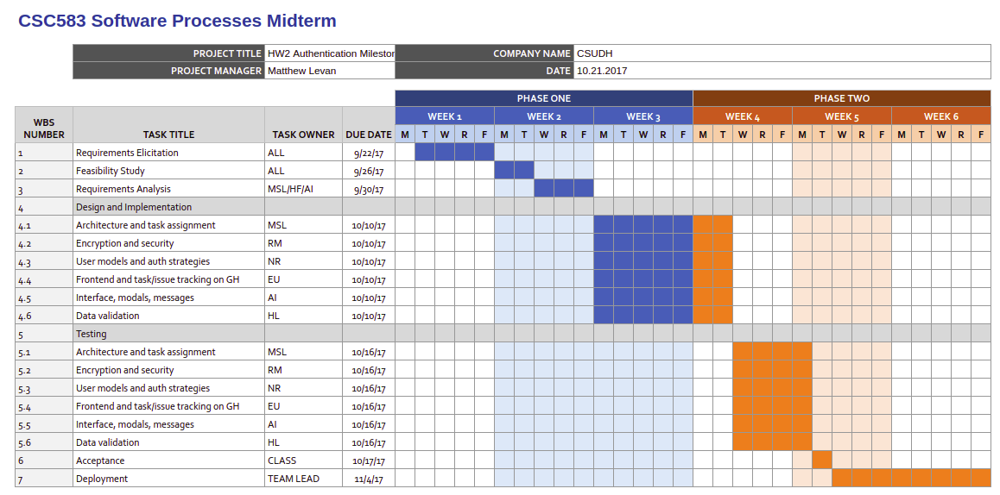

# Toro Net
## Getting
Fork the repo then clone it to your local machine.
```
git clone https://github.com/<your username>/toro-net.git
```

## Getting started with VirtualBox

Fork the repo then clone it to your local machine.

```bash
$ git clone https://github.com/<your username>/toro-net.git
```

Change your directory into the dir on your VirtualBox Ubuntu virtual machine.

```bash
$ cd toro-net
```

Create .env file. Add a `.env` file with your `PORT`, `MONGO_URI`, 
[password](https://github.com/jaredhanson/passport-github) like this:

```
PORT=3000
MONGO_URI=mongodb://127.0.0.1:27017/toro-net
GITHUB_ID=233245n234566kjh243f
GITHUB_SECRET=k2hj432kjgjkh2g34kj2g4jkh23g4jk2342jhg34
APP_URL=http://127.0.0.1:3000/
```
---
## Virtual Box Setup Instructions
### To use Vagrant, get started [here](#vagrant-setup-instructions)
Install dependencies (mongo, node, npm packages).  
```
bash dev-env.sh
```

Install dependencies (mongo, node, npm packages).

```bash
$ bash dev-env.sh
```

Install node packages with npm.

Open a new terminal window and navigate to toro-net. Run mongo as a service.  

```bash
$ ./bin/init-db.sh
```

```bash
$ npm install
``` 

Build and watch for changes.

```bash
$ npm run serve
```

Run the backend using nodemon  
```bash
$ ./node_modules/nodemon/bin/nodemon.js server.js
```

<<<<<<< HEAD
Open http://localhost:3000 in any web browser.
=======
---
# HW2 Milestone Diagram (Midterm)


>>>>>>> 7418a0dcee6288cc8ce48aeeeb26b83f28cf6f19
